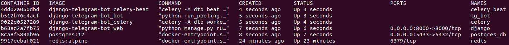

# django-telegram-bot
My sexy Django + python-telegram-bot + Celery + Redis + Postgres + Dokku + GitHub Actions template

## Local Testing
### .env

``` bash
#docker-compose
DB_CONTAINER_PORT=5432

#Telegram
TELEGRAM_TOKEN=bot_token

#DB
DB_USER=postgres
DB_USER_PASSWORD=postgres
DB_NAME=postgres
DATABASE_URL=postgres://${DB_USER}:${DB_USER_PASSWORD}@db:${DB_CONTAINER_PORT}/${DB_NAME}
```

### docker-compose

To run all services (django, postgres, redis, celery) at once type
``` bash
docker-compose up -d --build
```

Check status of the containers.
``` bash
docker ps -a
```
It should look similar to this:
<p align="left">
    
</p>

Try visit <a href="http://0.0.0.0:8000/tgadmin">django-admin panel</a>

### Custom database

To create user with password and database in PostgreSQL stop all containers: 
``` bash
docker-compose down
```
Change corresponding variables in .env file (DB_NAME, DB_USER, DB_USER_PASSWORD)<br>
```bash 
docker-compose up -d --build
docker exec -it postgres_db bash
psql -v DB_NAME="${DB_NAME}" -v DB_USER="${DB_USER}" -v DB_USER_PASSWORD="'${DB_USER_PASSWORD}'" -U postgres < sql/init.sql
```

### Create superuser

``` bash
docker exec -it django python manage.py createsuperuser
```

## Production 

All services that are going to be launched in production can be found in `Procfile` file. Dokku (open-source version of Heroku) uses `requirements.txt` to install everything and `Procfile` to run services afterwards. In `DOKKU_SCALE` you can find the number of processes to be launched (for load balancing).

**Postgres** and **Redis** are configured as Dokku plugins on a server. 

### Deploy on commit with Github Actions

Go to file .github/workflows/dokku.yml, enter your host name, deployed dokku app name and set SSH_PRIVATE_KEY secret variable via GitHub repo settings.
